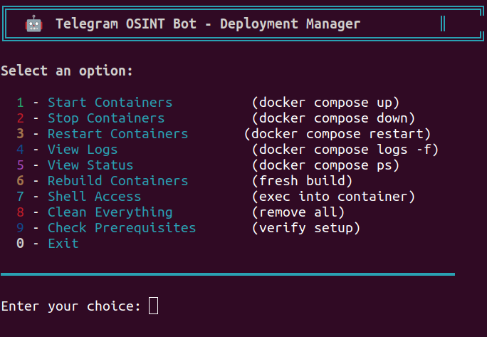

# 🔍 Telegram OSINT Recon Bot

Advanced network reconnaissance and threat-intelligence bot for Telegram.

---

## 📸 Deployment Manager (Docker Menu)

You can manage the bot with an interactive deployment panel:



---

## 🚀 Features

### **Network Tools**

* 🌐 WHOIS lookup
* 📡 Traceroute
* 🔎 DNS lookup (dig/nslookup)
* 📶 Ping
* 🔓 Port scanning (quick & full)
* 🔄 Reverse DNS lookup

### **IP Intelligence**

* 📍 IP geolocation
* ⚠️ AbuseIPDB reputation
* 🛡️ VirusTotal scanning
* 🔐 TOR/VPN/Proxy detection
* 🔍 Shodan integration

### **Security Tools**

* 📧 Email leak detection
* 🔒 SSL certificate analysis
* 📋 HTTP headers inspection
* 🌳 Subdomain enumeration

### **Advanced Features**

* 📊 Detailed threat reports
* ⚖️ IP comparison
* 📈 Interactive interface

---

## 🛠️ Quick Start (Docker Compose Recommended)

### **1. Clone the repository**

```bash
git clone https://github.com/muhammedshibilm/telegram-osint-bot.git
cd telegram-osint-bot
```

### **2. Add environment variables**

Create `.env`:

```bash
echo "TELEGRAM_BOT_TOKEN=your_telegram_bot_token
ABUSEIPDB_API_KEY=your_abuseipdb_api_key
VT_API_KEY=your_virustotal_api_key
SHODAN_API_KEY=your_shodan_api_key
ADMIN_USER_IDS=your_admin_user_ids" > .env
```

### **3. Make the deployment script executable**

```bash
chmod +x deploy.sh
```

### **4. Run the deployment manager**

```bash
./deploy.sh
```

This opens the interactive menu (shown in screenshot).

---

## 🧭 Manual Installation (Non-Docker)

### Install dependencies:

```bash
sudo apt-get install whois traceroute dnsutils masscan
pip install -r requirements.txt
```

### Run the bot:

```bash
python bot.py
```

---

## 🧩 Docker Commands (Latest Compose)

```bash
docker compose up -d        # Start bot
docker compose down         # Stop bot
docker compose restart      # Restart
docker compose logs -f      # View logs
docker compose up -d --build # Rebuild after changes
```

---

## 🔑 Optional API Keys

Get free keys:

* AbuseIPDB → [https://www.abuseipdb.com/register](https://www.abuseipdb.com/register)
* VirusTotal → [https://www.virustotal.com/gui/join-us](https://www.virustotal.com/gui/join-us)
* Shodan → [https://account.shodan.io/register](https://account.shodan.io/register)

Add them to `.env`.

---

## 📜 Commands

```
/start
/help
/whois <target>
/traceroute <target>
/dig <domain>
/ping <target>
/ipinfo <ip>
/portscan <ip>
/emailleaks <email>
/abuseip <ip>
/virustotal <ip>
/shodan <ip>
/sslcheck <domain>
/subdomain <domain>
/fullreport <ip>
/compare <ip1> <ip2>
```

---

## 🛡️ Security Notes

* Use only on **authorized targets**
* Protect API keys
* Respect rate limits
* Use responsibly

---

## 🐞 Troubleshooting

**Bot not responding**

* Check token
* Verify container: `docker compose ps`
* Logs: `docker compose logs`

**Permission issues**

* Masscan needs root or `CAP_NET_RAW`

---

## 📁 .gitignore

```gitignore
# Python
__pycache__/
*.py[cod]
env/
venv/
*.egg-info/

# Environment
.env
.env.local

# Logs
logs/
*.log

# IDE
.vscode/
.idea/

# OS
.DS_Store
Thumbs.db
```

---
